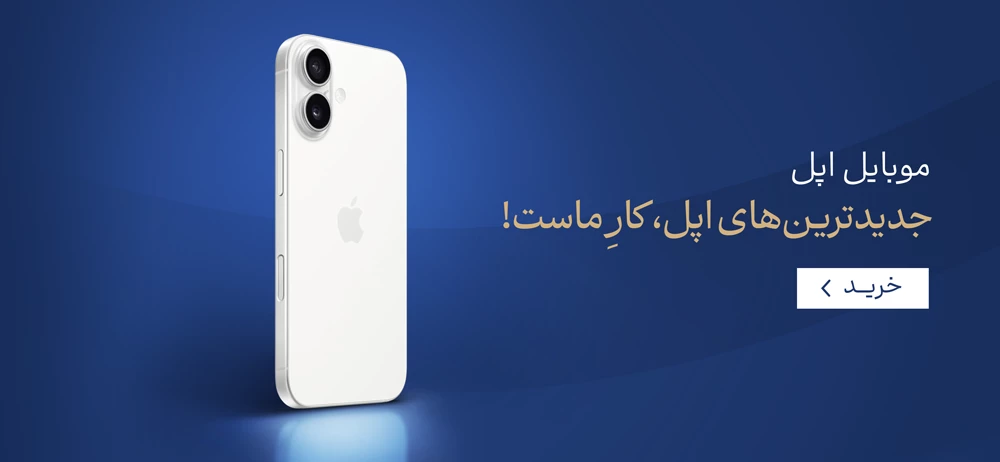

[تکنواف](https://saragolmohammadi.github.io/foroshgah1383/)

این پروژه یک سایت مشابه به تکنواف است که با استفاده از جدیدترین تکنولوژی‌های وب مانند HTML، CSS و JavaScript طراحی شده. هدف این پروژه، آشنایی با اصول طراحی وب و پیاده‌سازی مفاهیم پایه‌ای توسعه وب است. شما با استفاده از این سایت می‌توانید تجربه‌ای مشابه به سایت تکنواف را داشته باشید و از طراحی واکنش‌گرا (responsive) آن در تمام دستگاه‌ها بهره‌مند شوید.

ویژگی‌ها:

طراحی مدرن و کاربرپسند 

سازگاری کامل با موبایل و دسکتاپ

استفاده از تکنولوژی‌های روز وب

امکان افزودن محتوای بیشتر به راحتی

